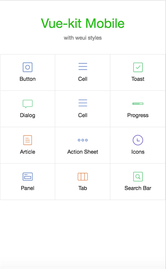

# Vue Start Kit

> A Vue.js project, base on vue-webpack template, with bulma, chart.js, font awesome. This is based on vue 2.x and vue-router 2.x. Using with vue 1.x and vue-router 0.7.x please checkout 1.0.

```blash
  git clone --branch 1.0 https://github.com/hsuehic/vue-kit.git vue-kit
```

> 用于快速构建产品原型或者演示demo

## Demo
* Desktop admin

[http://vue-kit.gismall.com/](http://vue-kit.gismall.com/index.html)

* Mobile

[http://vue-kit.gismall.com/mobile.html](http://vue-kit.gismall.com/mobile.html)

扫一扫


## Screen shots
* Desktop Admin


* Mobile



## Build Setup

``` bash
# install dependencies
npm install

# serve with hot reload at localhost:8080
npm run dev

# build for production with minification
npm run build

# run unit tests
npm run unit

# run e2e tests
npm run e2e

# run all tests
npm test
```
## develop settings
``` JavaScript
git config commit.template git_commit.template
```
using the comment style to commit editors

For detailed explanation on how things work, checkout the [guide](http://vuejs-templates.github.io/webpack/) and [docs for vue-loader](http://vuejs.github.io/vue-loader).
